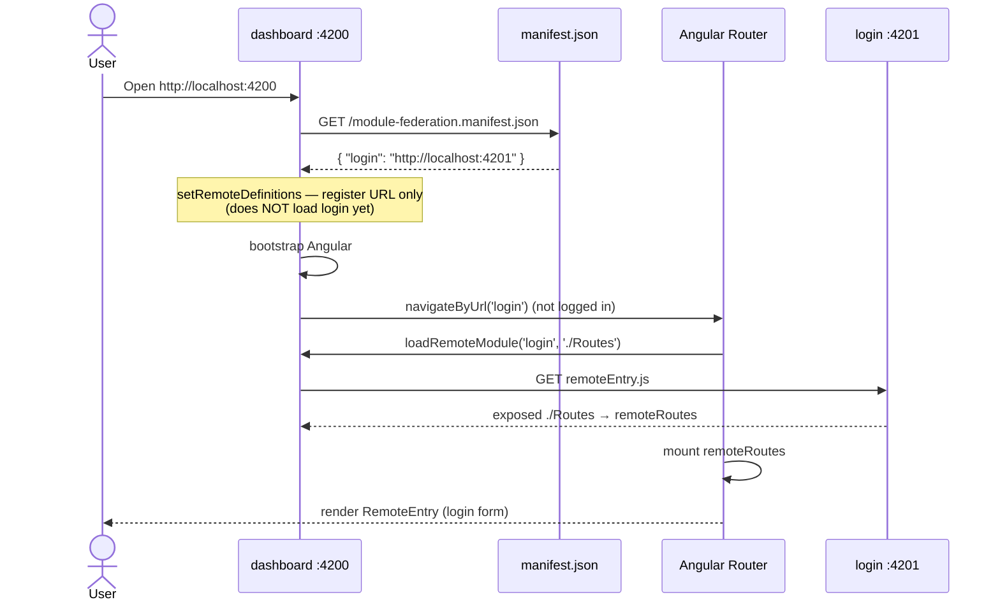
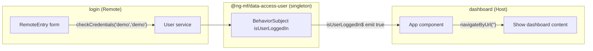
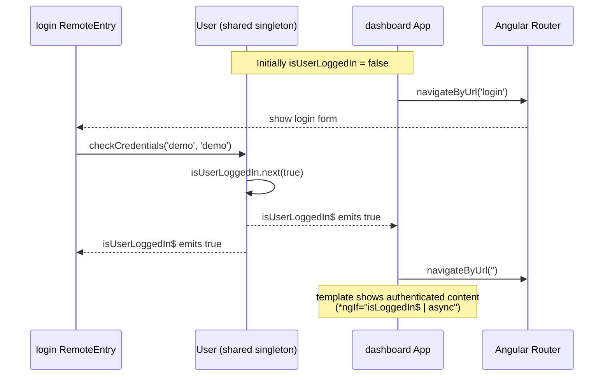
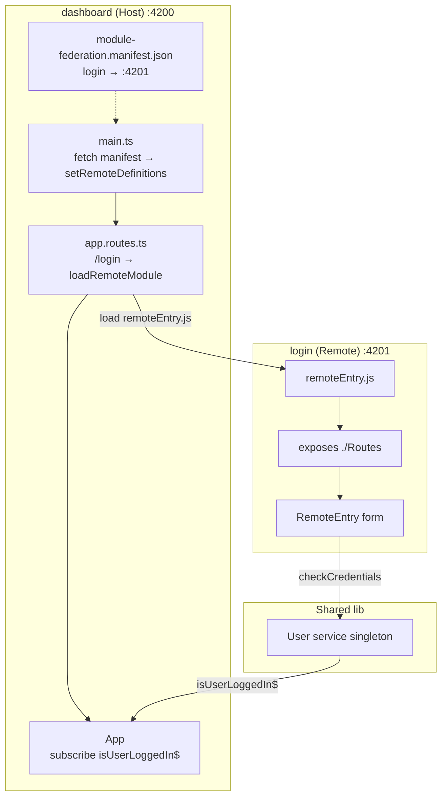

# Angular Micro Frontends with Nx + Dynamic Module Federation

This project demonstrates a Micro Frontend architecture in Angular using **Nx Workspace** and **Webpack Module Federation**, with the **Dynamic Federation** approach.

| Role | App | Port | Description |
|------|-----|------|-------------|
| **Host** | `dashboard` | 4200 | Shell app that consumes remotes |
| **Remote** | `login` | 4201 | Exposes `./Routes` for the login page |
| **Shared lib** | `@ng-mf/data-access-user` | — | Shared `User` service across MFEs |

---

## Prerequisites

- Node.js (v16 or higher)
- npm or yarn
- Nx CLI (optional): `npm install -g nx`

---

## Install Dependencies

```bash
npm install
```

---

## Run Applications (Development Mode)

### Start the `login` remote app

```bash
nx serve login
```

### In a new terminal, start the `dashboard` host app

```bash
nx serve dashboard --devRemotes=login
```

Visit: [http://localhost:4200](http://localhost:4200)

Login credentials (hardcoded in the `User` service): `demo` / `demo`

`--devRemotes=login` tells the Nx Module Federation dev server to coordinate the `login` remote during development.

---

## Static vs Dynamic Module Federation

The main difference is **when** the host learns each remote’s URL.

### Static Module Federation

Remotes are declared at **build time**:

```ts
remotes: [
  ['login', 'http://localhost:4201'],
]
```

| Aspect | Behavior |
|--------|----------|
| When URLs are known | Build time |
| Host rebuild to change a remote URL | Usually required |
| Complexity | Lower |
| Best for | Fixed remotes and stable URLs |

Webpack bakes remote references into the host bundle. Changing a remote’s deployment URL typically means updating config and rebuilding the host.

### Dynamic Module Federation (this project)

Remotes are **not** bound at build time:

```ts
remotes: [] // empty on purpose
```

URLs are registered at **runtime** via a manifest:

```ts
fetch('/module-federation.manifest.json')
  .then((res) => res.json())
  .then((definitions) => setRemoteDefinitions(definitions))
  .then(() => import('./bootstrap'));
```

| Aspect | Behavior |
|--------|----------|
| When URLs are known | Runtime (manifest / API) |
| Host rebuild to change a remote URL | Not required — update the manifest |
| Complexity | Slightly higher (manifest layer) |
| Best for | Multiple remotes, multi-env, independent deploys |

### Comparison

| | Static | Dynamic |
|--|--------|---------|
| `remotes` config | Name + URL hardcoded | Usually `[]` |
| Remote URL source | Build config | Manifest / registry at runtime |
| Change remote URL | Often rebuild host | Edit manifest only |
| Load API | Build-time remote wiring | `setRemoteDefinitions` + `loadRemoteModule` |
| Flexibility | Low | High |

**In short:** static = “compile-time destinations”; dynamic = “start the host, then decide where remotes live.”

---

## How Dynamic Federation Works Here

### Runtime flow

```
main.ts
  → fetch /module-federation.manifest.json
  → setRemoteDefinitions({ login: "http://localhost:4201" })
  → bootstrap Angular
  → navigate to /login
  → loadRemoteModule('login', './Routes')
  → load login remoteEntry.js and mount remote routes
```

### 1. Host config — no build-time remotes

`apps/dashboard/module-federation.config.ts`:

```ts
const config: ModuleFederationConfig = {
  name: 'dashboard',
  remotes: [],
};
```

Webpack is wired through `withModuleFederation` in `apps/dashboard/webpack.config.ts`.

### 2. Remote config — expose routes

`apps/login/module-federation.config.ts`:

```ts
const config: ModuleFederationConfig = {
  name: 'login',
  exposes: {
    './Routes': 'apps/login/src/app/remote-entry/entry.routes.ts',
  },
};
```

The remote exposes an Angular **route module** (`./Routes`), which fits `loadChildren` on the host.

### 3. Manifest — runtime remote registry

`apps/dashboard/public/module-federation.manifest.json`:

```json
{
  "login": "http://localhost:4201"
}
```

In production, point `login` at the real deployment URL. Updating this file does not require rebuilding the host.

### 4. Register definitions before bootstrap

`apps/dashboard/src/main.ts`:

```ts
import { setRemoteDefinitions } from '@nx/angular/mf';

fetch('/module-federation.manifest.json')
  .then((res) => res.json())
  .then((definitions) => setRemoteDefinitions(definitions))
  .then(() => import('./bootstrap').catch((err) => console.error(err)));
```

### 5. Lazy-load remotes from the router

`apps/dashboard/src/app/app.routes.ts`:

```ts
{
  path: 'login',
  loadChildren: () =>
    loadRemoteModule('login', './Routes').then((m) => m.remoteRoutes),
}
```

`loadRemoteModule` resolves the URL from `setRemoteDefinitions`, loads `remoteEntry.js`, and returns the exposed `./Routes` module.

---

## How Dashboard Calls Login

Dashboard does **not** `import` the login app or call its methods directly. It loads login through **Angular Router + `loadRemoteModule`**.

### Call site (the only business entry)

```ts
// apps/dashboard/src/app/app.routes.ts
{
  path: 'login',
  loadChildren: () =>
    loadRemoteModule('login', './Routes').then((m) => m.remoteRoutes),
}
```

| Argument | Meaning |
|----------|---------|
| `'login'` | Remote name (manifest key / MF `name`) |
| `'./Routes'` | Exposed module path from the login remote |

### When it runs

`App` watches auth state and redirects when logged out:

```ts
// apps/dashboard/src/app/app.ts
if (!loggedIn) {
  this.router.navigateByUrl('login');
}
```

Router matches `path: 'login'` → runs `loadChildren` → fetches login’s `remoteEntry.js` → mounts `remoteRoutes`.

### What login exposes

```ts
// apps/login/src/app/remote-entry/entry.routes.ts
export const remoteRoutes: Route[] = [
  { path: '', component: RemoteEntry },
];
```

Host receives a **route table**, not a component import. After mount, Angular renders `RemoteEntry` (the login form).

### Load sequence



Two distinct network steps:

| Step | Request | Purpose |
|------|---------|---------|
| 1. Register | `GET http://localhost:4200/module-federation.manifest.json` | Host’s own config — map names → URLs |
| 2. Load remote | `GET http://localhost:4201/remoteEntry.js` | Actually pull login’s federated entry |

---

## Cross-App Communication

Host and remote **do not call each other’s APIs**. They share one **singleton `User` service** from `@ng-mf/data-access-user`, so auth state stays in sync across MFEs.

### Why a shared service (not direct calls)

```
❌ dashboard ──import──► login.RemoteEntry.login()     (tight coupling)
❌ login ──callback──► dashboard.onLoginSuccess()      (hard across bundles)

✅ Both inject User → read/write the same BehaviorSubject
```

Module Federation treats the shared library as a **singleton**: host and remote get the **same** `User` instance in the browser (not two separate copies).

### Shared `User` service

`libs/shared/data-access-user/src/lib/user.ts`:

```ts
@Injectable({ providedIn: 'root' })
export class User {
  private isUserLoggedIn = new BehaviorSubject(false);
  isUserLoggedIn$ = this.isUserLoggedIn.asObservable();

  checkCredentials(username: string, password: string) {
    if (username === 'demo' && password === 'demo') {
      this.isUserLoggedIn.next(true);
    }
  }

  logout() {
    this.isUserLoggedIn.next(false);
  }
}
```

| Side | Role | Code |
|------|------|------|
| **login** (writer) | Form submit → `checkCredentials` | `RemoteEntry.login()` |
| **dashboard** (reader) | Subscribe → navigate / show content | `isLoggedIn$` in `App` |

### Communication flow



### Auth UX sequence



### Host template reaction

```html
<!-- apps/dashboard/src/app/app.html -->
<div *ngIf="isLoggedIn$ | async; else signIn">
  You are authenticated so you can see this content.
</div>
<ng-template #signIn>
  <router-outlet></router-outlet>
</ng-template>
```

- Logged out → `<router-outlet>` hosts the login remote routes.
- Logged in → outlet hidden; dashboard content is shown.

### Shared dependencies (framework + business)

| Layer | What is shared | How |
|-------|----------------|-----|
| Framework | `@angular/core`, `rxjs`, … | Auto singleton via `withModuleFederation` |
| Business | `@ng-mf/data-access-user` (`User`) | Same library + MF singleton → one instance |

Without singleton sharing, host and remote would each get their own `User`, and login success in the remote would **not** update the host UI.

---

## Key Files

| File | Role |
|------|------|
| `apps/dashboard/module-federation.config.ts` | Host MF config (`remotes: []`) |
| `apps/login/module-federation.config.ts` | Remote MF config (`exposes`) |
| `apps/dashboard/public/module-federation.manifest.json` | Runtime remote URL map |
| `apps/dashboard/src/main.ts` | Fetch manifest → `setRemoteDefinitions` → bootstrap |
| `apps/dashboard/src/app/app.routes.ts` | `loadRemoteModule` for `/login` |
| `apps/dashboard/src/app/app.ts` / `app.html` | Auth gate + outlet for remote |
| `apps/login/src/app/remote-entry/entry.routes.ts` | Exposed remote routes |
| `apps/login/src/app/remote-entry/entry.ts` | Login form → `User.checkCredentials` |
| `libs/shared/data-access-user/` | Shared user state across MFEs |

---

## Architecture



---

## Production / Static Serve

After building, you can serve the built artifacts:

- `dashboard:serve-static` → port 4200
- `login:serve-static` → port 4201

Ensure `module-federation.manifest.json` points `login` at the deployed remote URL before serving the host in each environment.
